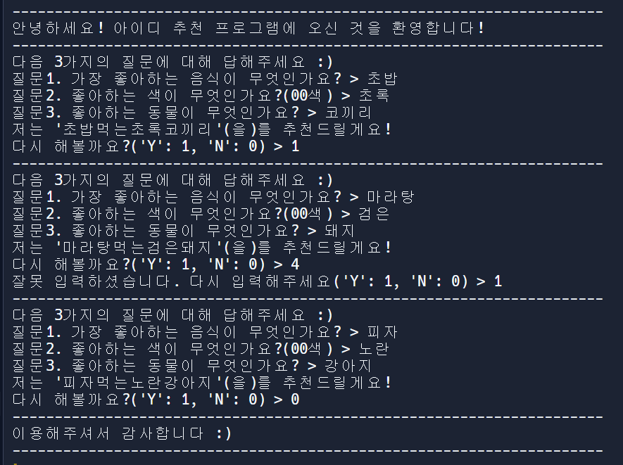

# **Python 부트캠프 : 100개의 프로젝트로 Python 개발 완전 정복**

# **학습 목표**
* Python의 주요 내용 정리
* 100개의 Python과 관련한 다양한 프로젝트 실습

# **진행 상황**
* [Project 1](#project-1). 아이디 생성기 만들기 / 대화형 코딩 연습

# **상세 보기**
## **Project 1**
  * **프로젝트명 : 아이디 생성기 만들기** (<a href="codes/Project1.py">코드 이동</a>)
  * 사용 함수 : `input`, `while`, `if`
  * 학습목표 : 대화형 코딩, 3가지의 질문을 통해 아이디를 추천하는 프로그램을 만든다.
  * 상세 설명
    * STEP1. 3가지 질문에 대한 input을 받는다.
    * STEP2. while, if 문을 사용하여 사용자의 선택에 따라 반복 여부를 결정하도록 한다.
    * STEP3. 잘못 입력받았을 경우 제대로 입력될 때까지 반복되도록 while 무한루프를 사용한다. 
    

      
결과 보기

      

      
      

    

      