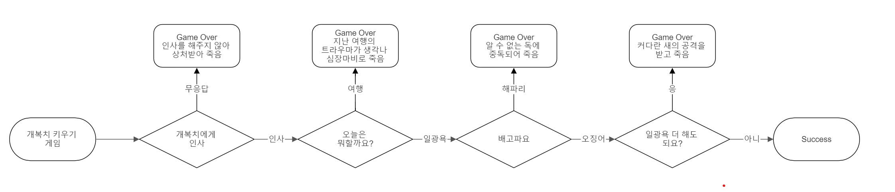

# **Python 부트캠프 : 100개의 프로젝트로 Python 개발 완전 정복**

# **학습 목표**
* Python의 주요 내용 정리
* 100개의 Python과 관련한 다양한 프로젝트 실습

# **진행 상황**
* [Project 1](#project-1). 아이디 생성기 만들기 / 대화형 코딩 연습
* [Project 2](#project-2). 더치페이 계산기 만들기 / 대화형 코딩 연습
* [Project 3](#project-3). 개복치 키우기 게임 / 대화형 코딩 연습  

# **상세 보기**
## **Project 1**
  * **프로젝트명 : 아이디 생성기 만들기** (<a href="codes/project1.py">코드 이동</a>)
  * 사용 함수 : `input`, `while`, `if`
  * 학습목표 : 대화형 코딩, 3가지의 질문을 통해 아이디를 추천하는 프로그램을 만든다.
  * 상세 설명
    * STEP1. 3가지 질문에 대한 input을 받는다.
    * STEP2. while, if 문을 사용하여 사용자의 선택에 따라 반복 여부를 결정하도록 한다.
    * STEP3. 잘못 입력받았을 경우 제대로 입력될 때까지 반복되도록 while 무한루프를 사용한다. 
    

      
결과 보기

      

      
      

    

## **Project 2**
  * **프로젝트명 : 더치페이 계산기** (<a href="codes/project2.py">코드 이동</a>)
  * 사용 함수 : `input`, `split`, `map`, `for`
  * 학습목표 : 대화형 코딩, 여러 변수를 입력받고 계산하여 요약할 수 있다.
  * 상세 설명
    * STEP1. 더치페이 대상자, 비용에 대한 input을 받는다.
    * STEP2. if 문을 사용하여 따로 계산할지의 여부를 결정한다.
    * STEP3. 따로 계산할 비용(주류)을 input 받는다.
    * STEP4. (주류) 대상자를 input 받는다.
    * STEP5. 계산 결과를 보고서와 같이 요약한다.
    

      
결과 보기

      

      
      

    

## **Project 3**
  * **프로젝트명 : 개복치 키우기 게임** (<a href="codes/project3.py">코드 이동</a>)
  * 사용 함수 : `input`, `while`, `if`, `lower`
  * 학습목표 : 대화형 코딩, 대문자 소문자에 관계없이 입력받았을 때 조건문에 따라 게임의 성공/실패를 결정할 수 있다.
  * 상세 설명
  
  
    * STEP1. 게임을 꾸미기 위해 [ASCII ART](https://ascii.co.uk/art/fish)를 참고하여 물고기를 표현한다.
    * STEP2. 개복치가 죽었을 때에 죽은 물고기를 표현하도록 dead() 함수를 만든다.
    * STEP3. 순서도에 따라 결정 사항을 input 받는다.
    * STEP4. if 문을 사용하여 개복치의 죽음 여부를 결정한다. 이때 dead() 함수를 만들어 죽을 때마다 이유가 나타나도록 한다.
    * STEP5. 게임이 끝나면 다시 게임을 진행할 것인지를 결정하도록 input 받는다.
    

      
결과 보기

      

      
      

    

